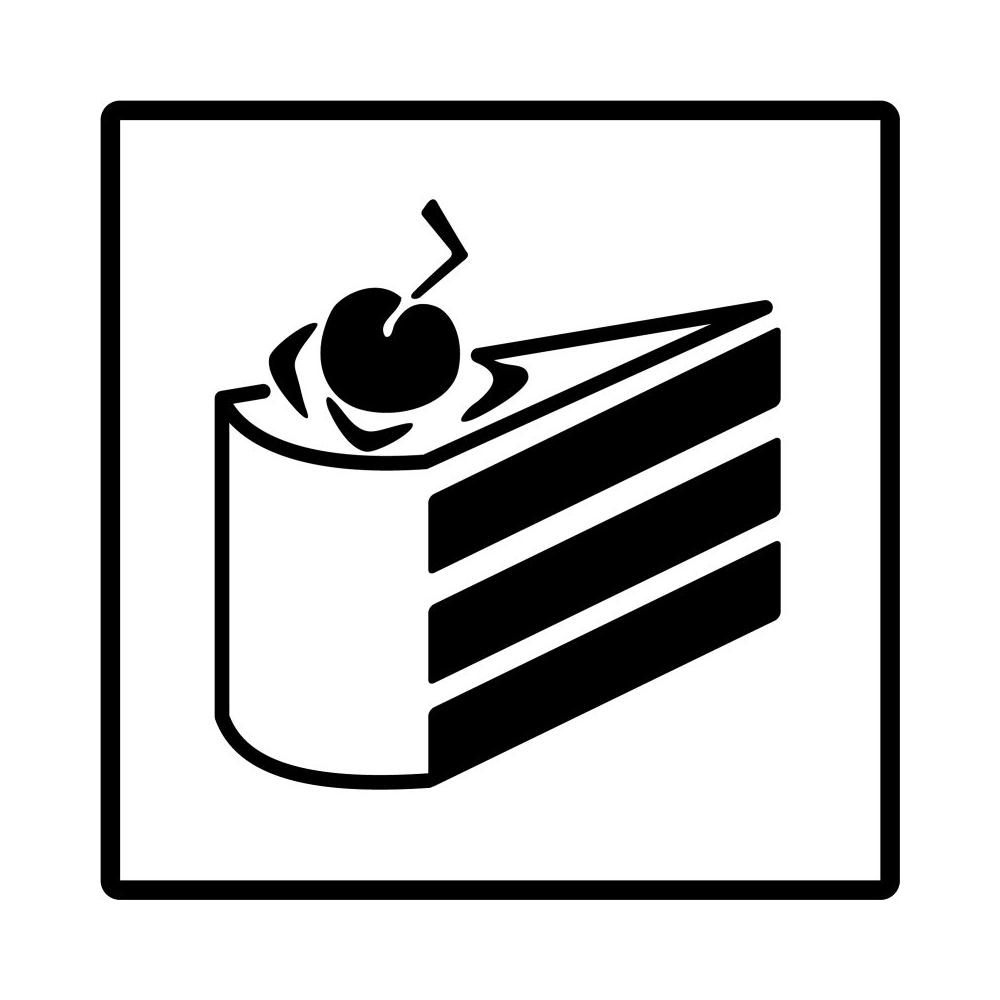

[Play on GitHub Pages](https://lwd-temp.github.io/still-alive-web-chs)

still-alive-web
===============
This repository contains the source of outro of Portal 1 made with HTML, CSS and JS. The project was made in order to celebrate Portal 1's 10th anniversary(2017/10/10). Originally project completed and published on 2017/10/10 00:00 AM Pacific Time.

根据游戏内简体中文翻译修改

Notice
------
This repository is only for **archive purpose only**, means it's **NOT INTENTED** to be contributed.

Copyright
---------
+ Portal ⓒ Valve Corporation, see "Copyright" section in [Valve Legal Info](https://store.steampowered.com/legal/)
+ `still-alive-web` made by [SD SkyKlouD](https://twitter.com/_SDSkyKlouD)
